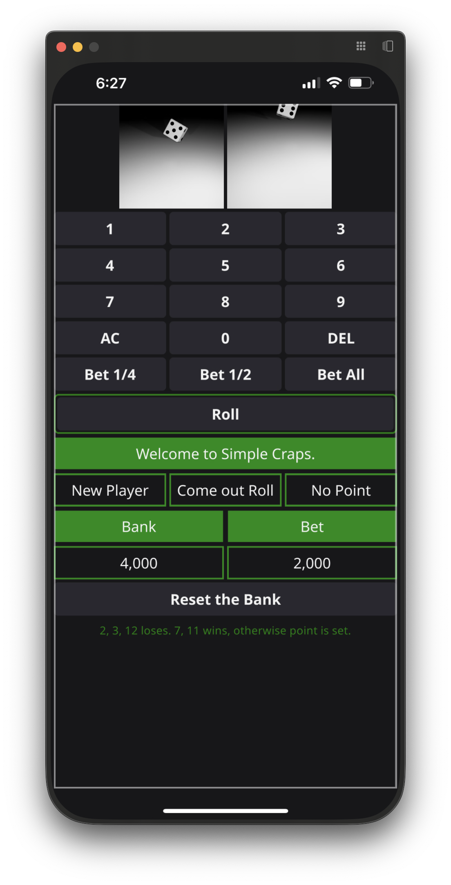

# Simple Craps Game

A simple game of craps. Just roll the dice and place pass line bets.

You are given 2,000 credits to start your game of craps. Select a bet, roll the dice (come out roll) to win or set the point. Only pass line bets are allowed. The complications of don't pass and other types of bets are not supported for simplicity. If your bank runs out, not to worry, it will be refreshed automatically. The bank is preserved across app updates.

This app can be installed from the App Store using this URL: https://apps.apple.com/us/app/simple-craps/id6744373914
